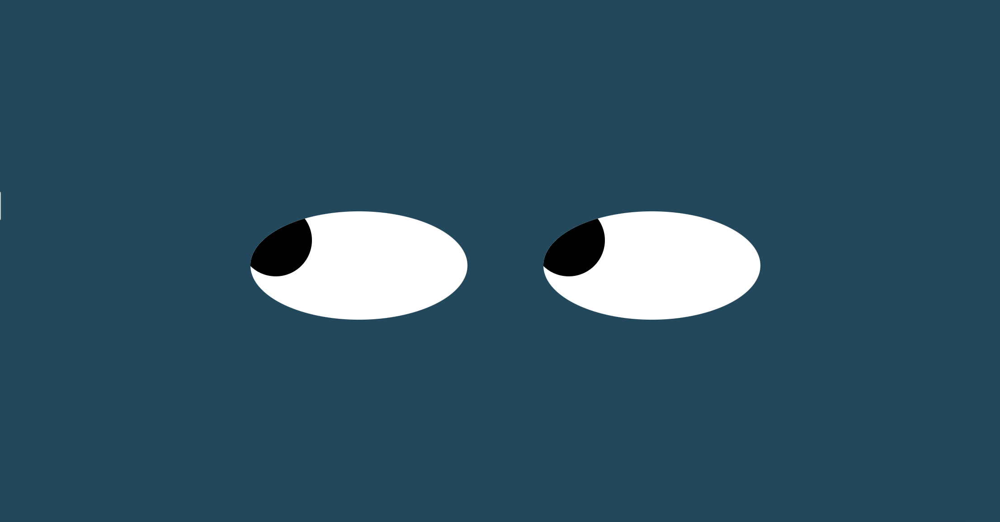

# Eye-Movement Project

## Description
This exercise is focused on using mouse events to bind DOM elements to events. In particular we were tasked with using the mouse movement event to update the position of two eye elements on the page so that the eyes follow the mouse position on the screen.

## Screenshot

## How to Run
You can open the game at the following link: 
To run the game on your machine, download the files via the green Code button in the GitHub repository and open on your local browser.

## Future Improvements
I would like to add more styles to the page so that the eyes appear as part of a face. I would also like to add a background color.

## License
MIT License

Copyright (c) 2021 Taylor Tremaine

Permission is hereby granted, free of charge, to any person obtaining a copy
of this software and associated documentation files (the "Software"), to deal
in the Software without restriction, including without limitation the rights
to use, copy, modify, merge, publish, distribute, sublicense, and/or sell
copies of the Software, and to permit persons to whom the Software is
furnished to do so, subject to the following conditions:

The above copyright notice and this permission notice shall be included in all
copies or substantial portions of the Software.

THE SOFTWARE IS PROVIDED "AS IS", WITHOUT WARRANTY OF ANY KIND, EXPRESS OR
IMPLIED, INCLUDING BUT NOT LIMITED TO THE WARRANTIES OF MERCHANTABILITY,
FITNESS FOR A PARTICULAR PURPOSE AND NONINFRINGEMENT. IN NO EVENT SHALL THE
AUTHORS OR COPYRIGHT HOLDERS BE LIABLE FOR ANY CLAIM, DAMAGES OR OTHER
LIABILITY, WHETHER IN AN ACTION OF CONTRACT, TORT OR OTHERWISE, ARISING FROM,
OUT OF OR IN CONNECTION WITH THE SOFTWARE OR THE USE OR OTHER DEALINGS IN THE
SOFTWARE.
